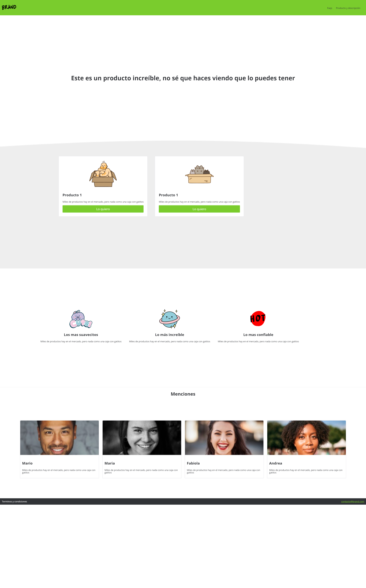
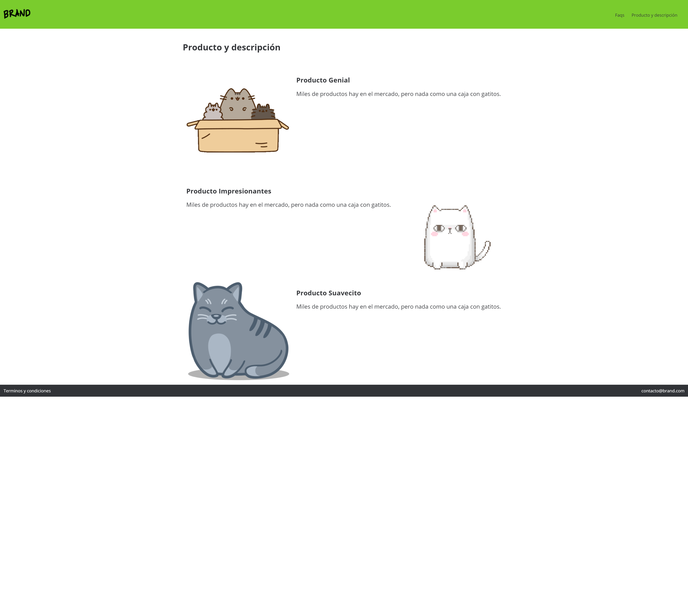
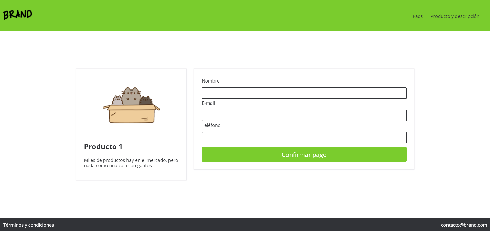
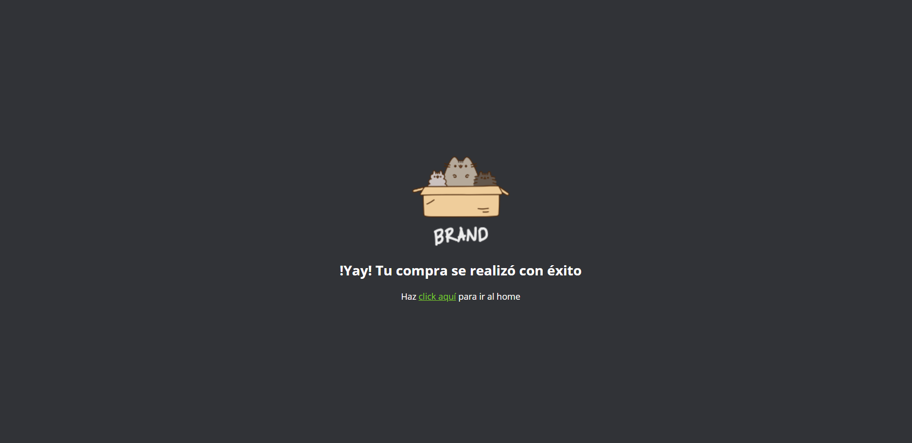
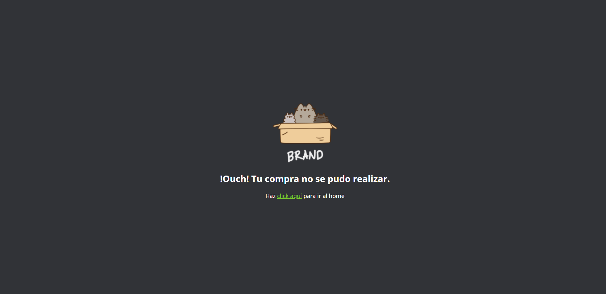

# tienda-paypal

Página web que se conecta con PayPal para realizar el proceso de pago de los productos ofrecidos. Proceso completo de creación de un producto digital desde la elaboración del paper wireframe para definir el flujo de navegación, pasando por el diseño y maquetación, codificación de animaciones y diseño responsive design, hasta la publicación usando GitHub Pages.

**Página Inicio:**

**Página Producto:**

**Página Venta:**

**Página Éxito:**

**Página Falla:**

